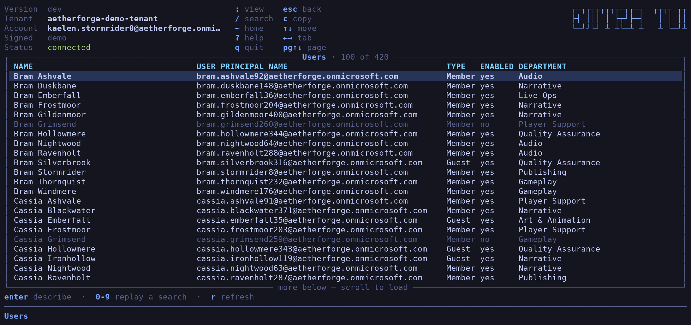
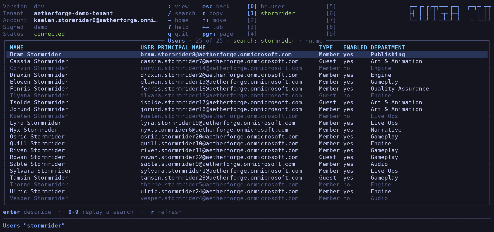
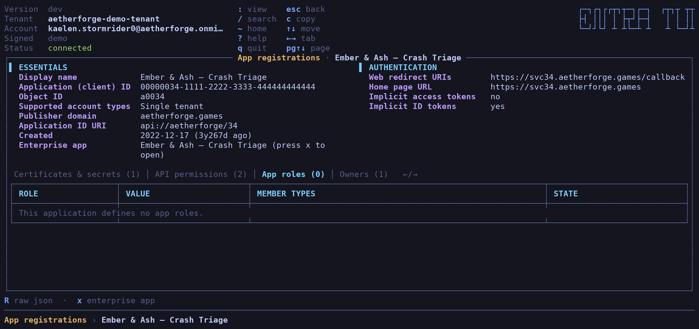
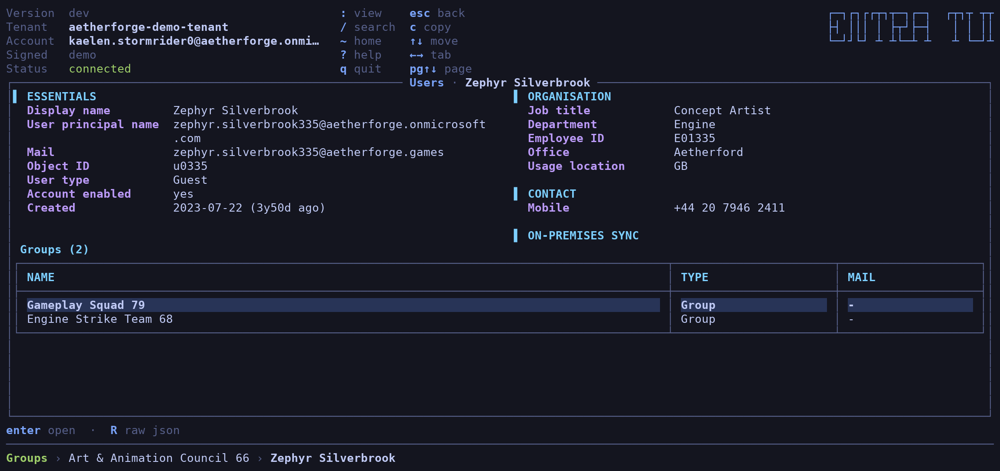
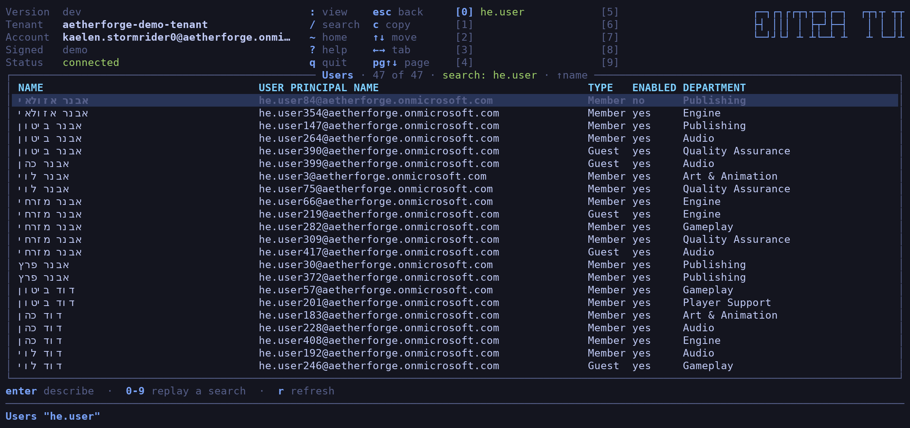

# Screens

Every image is the demo directory (`entra-tui -demo`), captured through a
pseudo-terminal and drawn cell by cell from the terminal buffer — the grid the
app laid out, in the colours it asked for.

## Dashboard

One card per view, with the directory-wide total from Graph's `$count`
endpoint. A view you cannot enumerate shows no number.

## Users

Rows are tinted whole by object state: disabled accounts dimmed, lapsed
credentials amber. The tint survives the cursor landing on the row.

## Search

`/` re-queries Graph with `$search`. A search that finds something takes one
of ten fixed slots, replayed with `0`–`9`.

## App registration

The object's own fields on top, everything enumerating other objects in a tab
strip below. Wide terminals get two columns.

## API permissions

GUIDs resolved to names against each referenced API's service principal, with
type, admin consent and status.

## Following a link

`enter` on a member opens it in a pane of its own; the trail along the bottom
shows how far in you are, and `esc` unwinds it.

## Confirming a change

Both parties named by display name *and* object id. Only `y` proceeds.

## Right-to-left names

Reordered for terminals that do not implement the bidirectional algorithm,
and still left-aligned like every other cell.

